# 🎓 Online Learning Platform - Hệ thống Học Trực Tuyến

Nền tảng học trực tuyến cho phép **Giảng viên** tạo và quản lý khóa học, **Học viên** đăng ký - thanh toán - học tập trên cùng một hệ thống.

---

## 📋 Mục Lục

- [Tính Năng Chính](#-tính-năng-chính)
- [Công Nghệ Sử Dụng](#️-công-nghệ-sử-dụng)
- [Cấu Trúc Dự Án](#-cấu-trúc-dự-án)
- [Hướng Dẫn Chạy Nhanh](#-hướng-dẫn-chạy-nhanh)
- [Lộ Trình Phát Triển](#-lộ-trình-phát-triển)

---

## 📸 Demo & Giao Diện

### 👨‍🏫 Giao Diện Giảng Viên (Instructor)

#### Dashboard
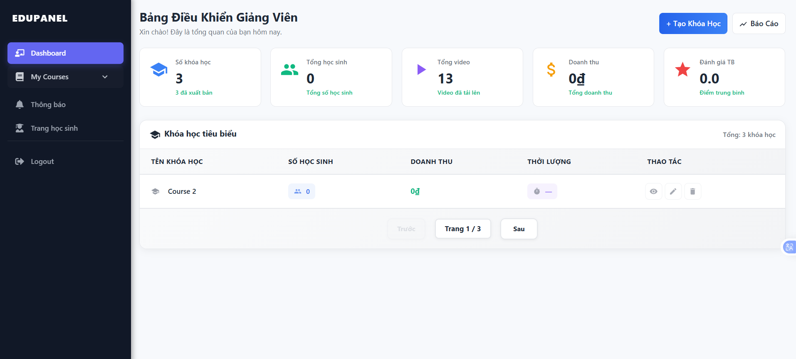
*Dashboard giảng viên với thống kê khóa học, học viên và doanh thu*

#### Danh Sách Khóa Học
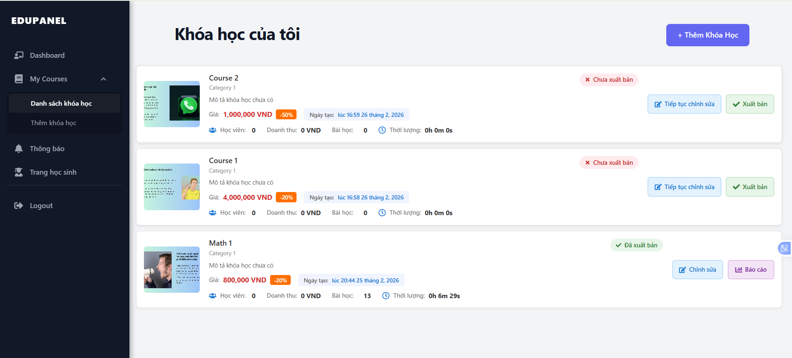
*Quản lý danh sách khóa học của giảng viên*

#### Thêm Mới Khóa Học
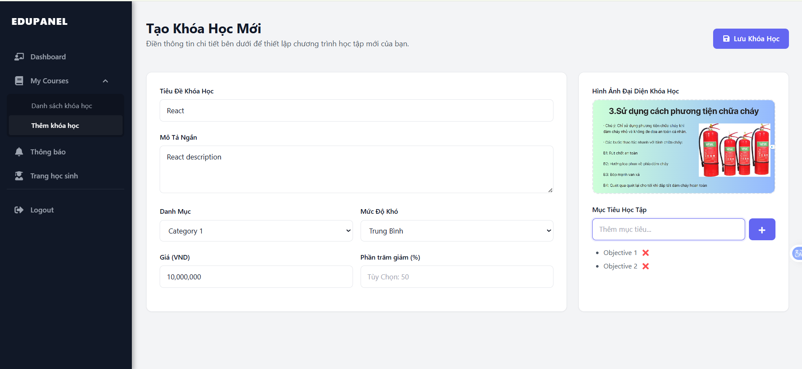
*Tạo khóa học mới với đầy đủ thông tin*

#### Chi Tiết Khóa Học
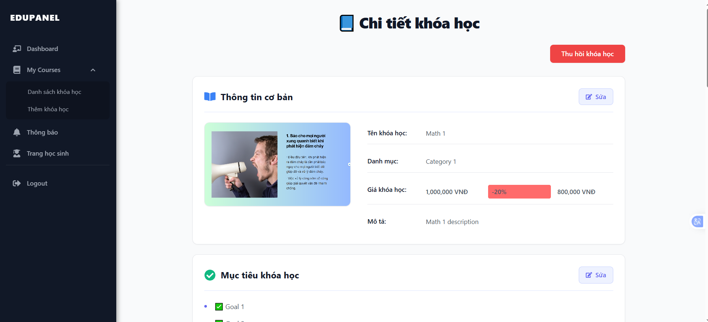
*Xem thông tin chi tiết và quản lý khóa học*

#### Quản Lý Bài Học
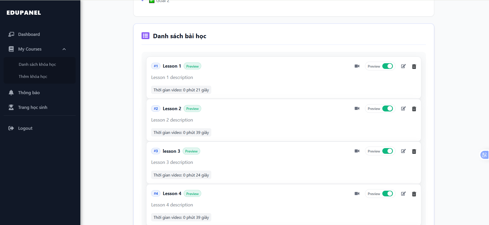
*Tổ chức bài học theo chương trong khóa học*

#### Xem Bài Học
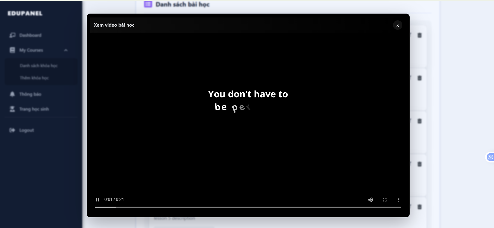
*Xem nội dung bài học đã tạo*

---

### 👨‍🎓 Giao Diện Học Viên (Student)

#### Trang Chủ 1
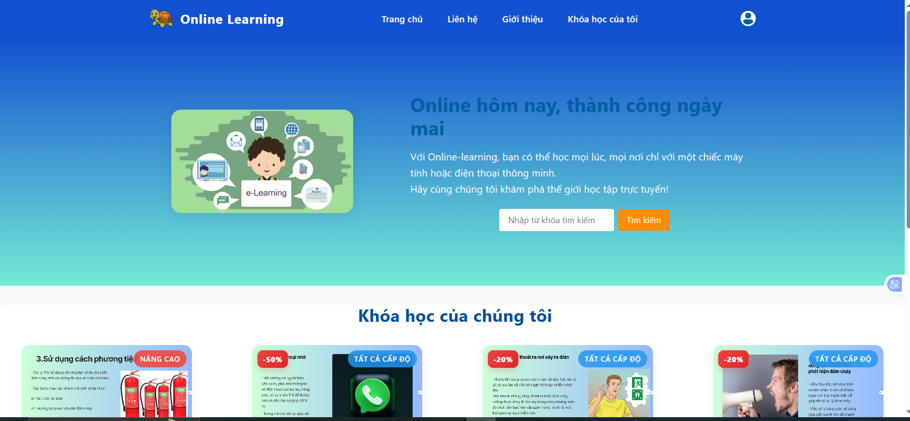
*Trang chủ với danh sách khóa học nổi bật*

#### Trang Chủ 2
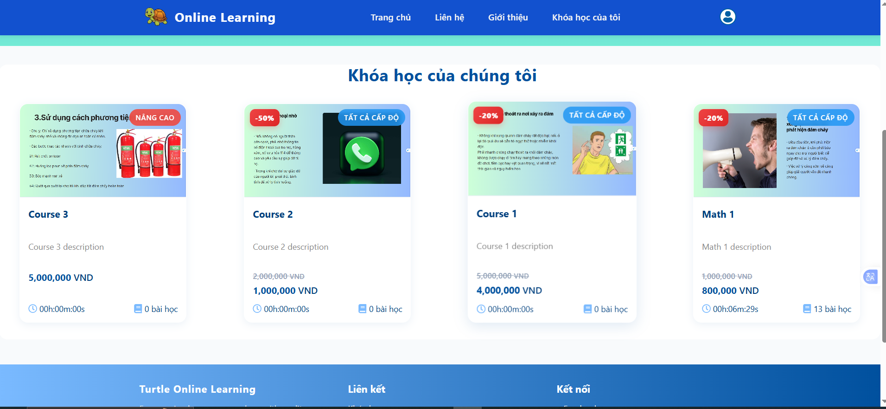
*Khám phá thêm khóa học theo danh mục*

#### Các Khóa Học Của Tôi
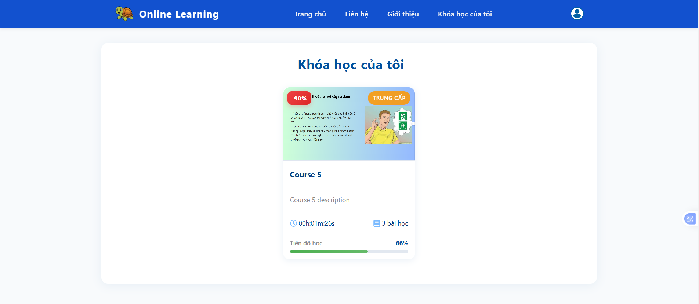
*Quản lý danh sách khóa học đã đăng ký*

#### Chi Tiết Khóa Học
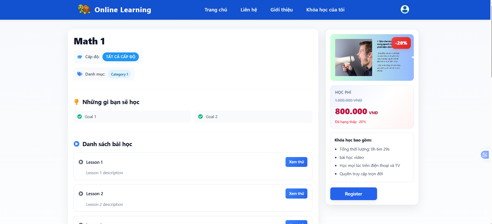
*Xem thông tin chi tiết khóa học trước khi đăng ký*

#### Học Tập
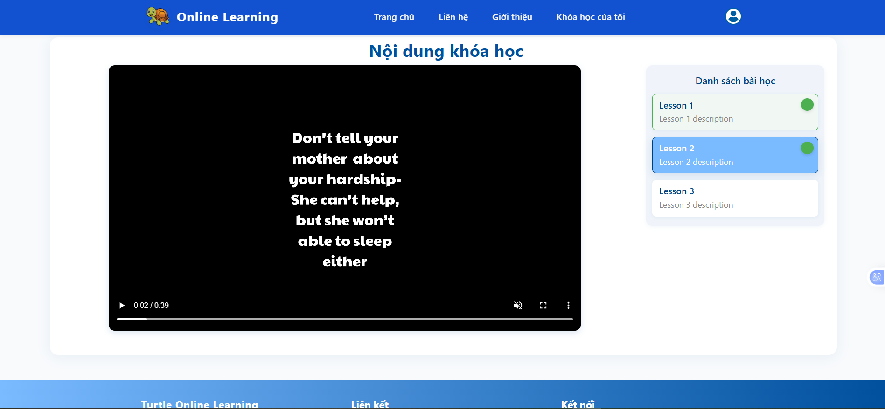
*Tham gia bài học và theo dõi tiến độ*

#### Xem Trước Bài Học
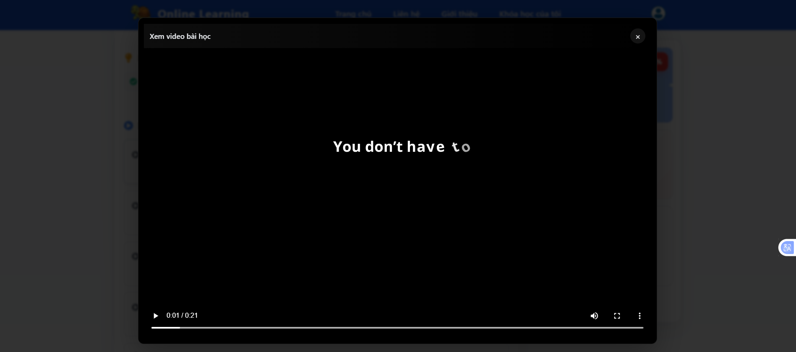
*Xem nội dung bài học chi tiết*

---

## 🚀 Tính Năng Chính

### 👨‍🏫 Dành cho Giảng viên
- ✅ Quản lý khóa học (thêm/sửa/xóa)
- ✅ Quản lý bài học, chương, tài liệu, video
- ✅ Publish/Unpublish khóa học
- ✅ Dashboard thống kê

### 👨‍🎓 Dành cho Học viên
- ✅ Tìm kiếm và khám phá khóa học
- ✅ Đăng ký khóa học
- ✅ Theo dõi tiến độ học
- ✅ Thanh toán qua ZaloPay

### 🛡️ Hệ Thống & Bảo Mật
- ✅ Đăng ký/đăng nhập
- ✅ JWT Authentication
- ✅ Spring Security phân quyền

---

## 🛠️ Công Nghệ Sử Dụng

### Backend
- Spring Boot (Java)
- Spring Security + JWT
- MySQL
- Maven

### Frontend
- React.js
- SCSS/SASS
- Redux
- Axios

### Dịch vụ tích hợp
- ZaloPay Sandbox
- Firebase / AWS S3 (lưu trữ)

---

## 📁 Cấu Trúc Dự Án

> Lưu ý: các thư mục `plan/`, `weeklyReport/`, `finalReport/` là tài liệu nội bộ, đã ignore và **không đẩy lên GitHub**.

```
online_learning/
├── README.md
├── demoImages/
└── source_code/
	├── online_learning_client/              # Frontend React
	│   ├── FRONTEND_RUN_GUIDE.md
	│   ├── package.json
	│   ├── public/
	│   └── src/
	└── online_learning_server/              # Backend Spring Boot
		├── BACKEND_RUN_GUIDE.md
		├── pom.xml
		├── docker-compose.yaml
		└── src/
```

---

## 💻 Hướng Dẫn Chạy Nhanh

### 1) Chạy Backend

- Tài liệu chi tiết: [source_code/online_learning_server/BACKEND_RUN_GUIDE.md](source_code/online_learning_server/BACKEND_RUN_GUIDE.md)

```bash
cd source_code/online_learning_server
mvn clean install
mvn spring-boot:run
```

### 2) Chạy Frontend

- Tài liệu chi tiết: [source_code/online_learning_client/FRONTEND_RUN_GUIDE.md](source_code/online_learning_client/FRONTEND_RUN_GUIDE.md)

```bash
cd source_code/online_learning_client
npm install
npm start
```

### 3) Biến môi trường frontend (`.env`)

```env
REACT_APP_BASE_URL=http://localhost:8080/online_learning
```

---

## 📅 Lộ Trình Phát Triển

- [ ] Hoàn thiện hệ thống báo cáo chi tiết cho giảng viên
- [ ] Tích hợp thông báo qua Email
- [ ] Thêm tính năng chat trực tiếp giữa giảng viên và học viên
- [ ] Xây dựng forum thảo luận cho mỗi bài học

---

## 📞 Hỗ Trợ

Nếu gặp vấn đề khi cài đặt hoặc chạy dự án:
1. Kiểm tra đúng thư mục frontend/backend theo cấu trúc mới.
2. Xem mục troubleshooting trong:
   - [source_code/online_learning_client/FRONTEND_RUN_GUIDE.md](source_code/online_learning_client/FRONTEND_RUN_GUIDE.md)
   - [source_code/online_learning_server/BACKEND_RUN_GUIDE.md](source_code/online_learning_server/BACKEND_RUN_GUIDE.md)
3. Kiểm tra logs trong terminal và browser console.

---

## 📄 License

Dự án phục vụ mục đích học tập và nghiên cứu.

---

**Chúc bạn triển khai thành công! 🎉**