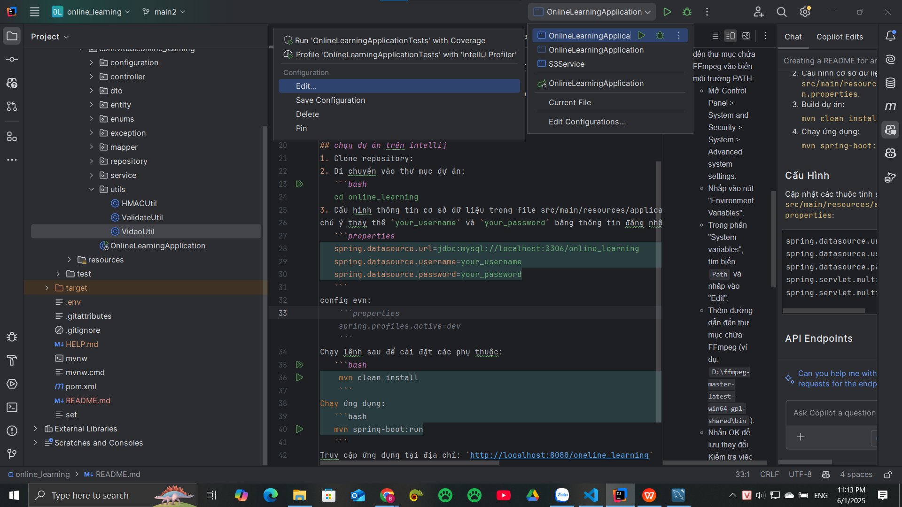
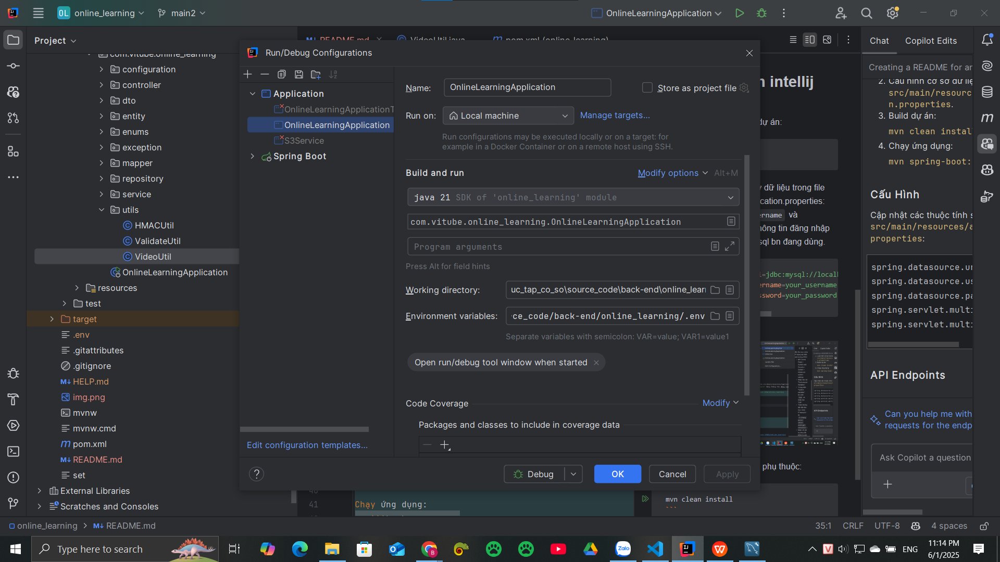

## Yêu Cầu
- Java 21 hoặc cao hơn. https://vntalking.com/huong-dan-download-va-cai-dat-jdk-java-development-kit.html
- Maven 3.8 hoặc cao hơn. https://viblo.asia/p/cai-dat-maven-tren-mac-va-windows-6BAMYVXBGnjz
- Cơ sở dữ liệu MySQL. https://www.thegioididong.com/game-app/huong-dan-cach-tai-cai-dat-mysql-ban-moi-nhat-chi-tiet-tung-1299084
- FFmpeg được cài đặt và cấu hình.

## hướng dẫn cài đặt FFmpeg và cấu hình
truy câp link sau để tải: https://drive.google.com/drive/folders/1W8yWbGigS4UgH5fIUo5hoBDmYAqlG7Jn?usp=sharing
- Giải nén tệp tải về và đặt vào ổ đĩa D:\
- Thêm đường dẫn đến thư mục chứa FFmpeg vào biến môi trường PATH:
  - Mở Control Panel > System and Security > System > Advanced system settings.
  - Nhấp vào nút "Environment Variables".
  - Trong phần "System variables", tìm biến `Path` và nhấp vào "Edit".
  - Thêm đường dẫn đến thư mục chứa FFmpeg (ví dụ: `D:\ffmpeg-master-latest-win64-gpl-shared\bin`).
  - Nhấn OK để lưu thay đổi.
Kiểm tra việc cài đặt FFmpeg bằng cách mở Command Prompt và chạy lệnh:
```bash
ffmpeg -version
```
## chạy dự án trên intellij
1. Clone repository:
2. Di chuyển vào thư mục dự án:
   ```bash
   cd online_learning
3. Cấu hình thông tin cơ sở dữ liệu trong file src/main/resources/application.properties:
chú ý thay thế `your_username` và `your_password` bằng thông tin đăng nhập của bạn và cổng mà mysql bn đang dùng.
   ```properties
   spring.datasource.url=jdbc:mysql://localhost:3306/online_learning
   spring.datasource.username=your_username
   spring.datasource.password=your_password
   ```
config evn:
click vào edit

ở phần environment variables, chỉ đến file .env

click ok
Chạy lệnh sau để cài đặt các phụ thuộc:
   ```bash
    mvn clean install
    ```
Chạy ứng dụng:
   ```bash
   mvn spring-boot:run
   ```
Truy cập ứng dụng tại địa chỉ: `http://localhost:8080/oneline_learning`