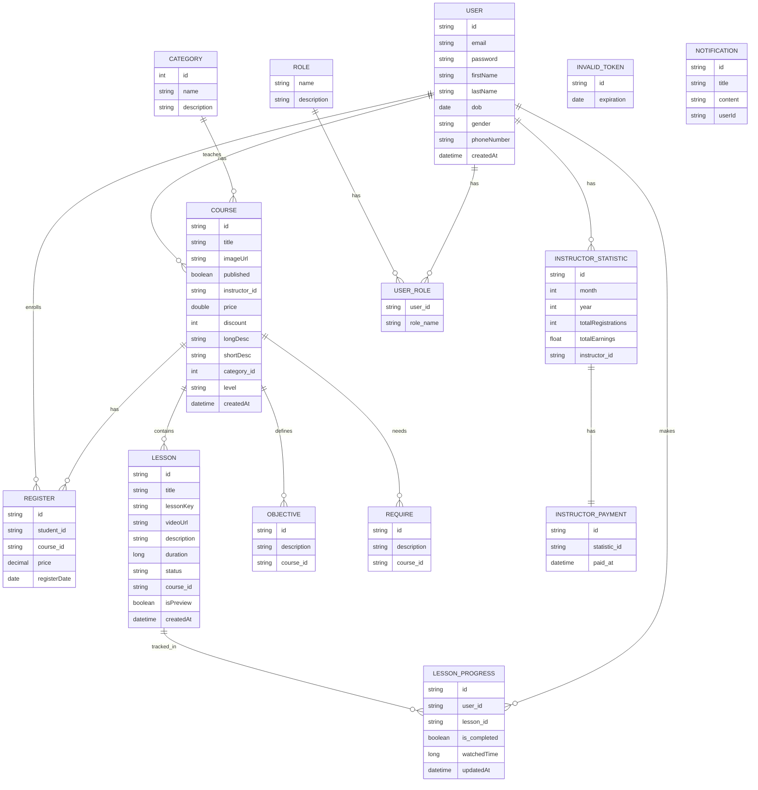

# Mô tả cơ sở dữ liệu hệ thống Online Learning

Đây là tài liệu mô tả cấu trúc cơ sở dữ liệu cho hệ thống Online Learning, dựa trên các entity được định nghĩa trong mã nguồn Java.

## Sơ đồ quan hệ thực thể (ERD) bằng Mermaid

## Các bảng (Entities)

### 1. `categories`
- **Mô tả:** Lưu trữ thông tin về các danh mục khóa học.
- **Trường:**
    - `id` (int): Khóa chính, tự động tăng.
    - `name` (String): Tên danh mục (duy nhất, không null).
    - `description` (String): Mô tả danh mục.
- **Quan hệ:** Một danh mục có nhiều khóa học (`OneToMany` với `Course`).

### 2. `courses`
- **Mô tả:** Lưu trữ thông tin chi tiết về các khóa học.
- **Trường:**
    - `id` (String): Khóa chính, UUID.
    - `title` (String): Tiêu đề khóa học.
    - `imageUrl` (String): URL hình ảnh của khóa học.
    - `published` (Boolean): Trạng thái xuất bản của khóa học.
    - `instructor_id` (String): Khóa ngoại đến `User` (giảng viên).
    - `price` (Double): Giá gốc của khóa học.
    - `discount` (Integer): Phần trăm giảm giá.
    - `longDesc` (String): Mô tả dài về khóa học (TEXT).
    - `shortDesc` (String): Mô tả ngắn về khóa học.
    - `category_id` (int): Khóa ngoại đến `Category`.
    - `level` (Enum): Cấp độ khóa học (ENUM, e.g., BEGINNER, INTERMEDIATE, ADVANCED).
    - `createdAt` (LocalDateTime): Thời gian tạo khóa học.
- **Quan hệ:**
    - Nhiều khóa học thuộc một giảng viên (`ManyToOne` với `User`).
    - Một khóa học có nhiều đăng ký (`OneToMany` với `Register`).
    - Một khóa học có nhiều bài học (`OneToMany` với `Lesson`).
    - Một khóa học có nhiều mục tiêu (`OneToMany` với `Objective`).
    - Một khóa học có nhiều yêu cầu (`OneToMany` với `Require`).
    - Nhiều khóa học thuộc một danh mục (`ManyToOne` với `Category`).

### 3. `instructor_payments`
- **Mô tả:** Ghi lại các khoản thanh toán cho giảng viên.
- **Trường:**
    - `id` (String): Khóa chính, UUID.
    - `statistic_id` (String): Khóa ngoại đến `InstructorStatic` (duy nhất, không null).
    - `paid_at` (LocalDateTime): Thời gian thanh toán.
- **Quan hệ:** Một khoản thanh toán liên kết với một thống kê giảng viên (`OneToOne` với `InstructorStatic`).

### 4. `instructor_statistics`
- **Mô tả:** Lưu trữ thống kê hàng tháng của giảng viên.
- **Trường:**
    - `id` (String): Khóa chính, UUID.
    - `month` (int): Tháng của thống kê.
    - `year` (int): Năm của thống kê.
    - `totalRegistrations` (int): Tổng số lượt đăng ký trong tháng.
    - `totalEarnings` (float): Tổng thu nhập trong tháng.
    - `instructor_id` (String): Khóa ngoại đến `User` (giảng viên).
- **Quan hệ:** Nhiều thống kê thuộc một giảng viên (`ManyToOne` với `User`).

### 5. `invalid_tokens`
- **Mô tả:** Lưu trữ các token JWT không hợp lệ (đã bị revoked hoặc hết hạn sớm).
- **Trường:**
    - `id` (String): Khóa chính (chính là JWT ID).
    - `expiration` (Date): Thời gian hết hạn của token.

### 6. `lessons`
- **Mô tả:** Lưu trữ thông tin về các bài học trong mỗi khóa học.
- **Trường:**
    - `id` (String): Khóa chính, UUID.
    - `title` (String): Tiêu đề bài học.
    - `lessonKey` (String): Khóa riêng cho bài học (có thể dùng cho lưu trữ video).
    - `videoUrl` (String): URL của video bài học.
    - `description` (String): Mô tả bài học (TEXT).
    - `duration` (long): Thời lượng bài học (giây).
    - `status` (String): Trạng thái bài học.
    - `course_id` (String): Khóa ngoại đến `Course`.
    - `isPreview` (Boolean): Cho biết bài học có phải là bài học xem trước hay không.
    - `createdAt` (LocalDateTime): Thời gian tạo bài học.
- **Quan hệ:** Nhiều bài học thuộc một khóa học (`ManyToOne` với `Course`).

### 7. `lesson_progresses`
- **Mô tả:** Theo dõi tiến độ học tập của người dùng đối với từng bài học.
- **Trường:**
    - `id` (String): Khóa chính, UUID.
    - `user_id` (String): Khóa ngoại đến `User`.
    - `lesson_id` (String): Khóa ngoại đến `Lesson`.
    - `is_completed` (boolean): Trạng thái hoàn thành bài học.
    - `watchedTime` (long): Thời gian đã xem (giây).
    - `updatedAt` (LocalDateTime): Thời gian cập nhật tiến độ.
- **Quan hệ:** Nhiều tiến độ bài học thuộc một người dùng (`ManyToOne` với `User`) và nhiều tiến độ bài học thuộc một bài học (`ManyToOne` với `Lesson`).

### 8. `objectives`
- **Mô tả:** Lưu trữ các mục tiêu học tập của một khóa học.
- **Trường:**
    - `id` (String): Khóa chính, UUID.
    - `description` (String): Mô tả mục tiêu.
    - `course_id` (String): Khóa ngoại đến `Course`.
- **Quan hệ:** Nhiều mục tiêu thuộc một khóa học (`ManyToOne` với `Course`).

### 9. `registers`
- **Mô tả:** Ghi lại thông tin đăng ký khóa học của học viên.
- **Trường:**
    - `id` (String): Khóa chính, UUID.
    - `student_id` (String): Khóa ngoại đến `User` (học viên).
    - `course_id` (String): Khóa ngoại đến `Course`.
    - `price` (BigDecimal): Giá khóa học tại thời điểm đăng ký.
    - `registerDate` (LocalDate): Ngày đăng ký.
- **Quan hệ:** Nhiều đăng ký thuộc một học viên (`ManyToOne` với `User`) và nhiều đăng ký thuộc một khóa học (`ManyToOne` với `Course`).

### 10. `course_requirements`
- **Mô tả:** Lưu trữ các yêu cầu cần thiết để tham gia một khóa học.
- **Trường:**
    - `id` (String): Khóa chính, UUID.
    - `description` (String): Mô tả yêu cầu.
    - `course_id` (String): Khóa ngoại đến `Course`.
- **Quan hệ:** Nhiều yêu cầu thuộc một khóa học (`ManyToOne` với `Course`).

### 11. `roles`
- **Mô tả:** Định nghĩa các vai trò người dùng trong hệ thống (ví dụ: ADMIN, USER, INSTRUCTOR).
- **Trường:**
    - `name` (Enum): Tên vai trò (khóa chính, ENUM).
    - `description` (String): Mô tả vai trò.
- **Quan hệ:** Nhiều vai trò có nhiều người dùng (`ManyToMany` với `User`).

### 12. `users`
- **Mô tả:** Lưu trữ thông tin người dùng (học viên, giảng viên, quản trị viên).
- **Trường:**
    - `id` (String): Khóa chính, UUID.
    - `email` (String): Email người dùng (duy nhất).
    - `password` (String): Mật khẩu (không null).
    - `firstName` (String): Tên.
    - `lastName` (String): Họ.
    - `dob` (LocalDate): Ngày sinh.
    - `gender` (Enum): Giới tính (ENUM).
    - `phoneNumber` (String): Số điện thoại.
    - `createdAt` (LocalDateTime): Thời gian tạo tài khoản.
- **Quan hệ:**
    - Nhiều người dùng có nhiều vai trò (`ManyToMany` với `Role`).
    - Một người dùng có nhiều khóa học (nếu là giảng viên) (`OneToMany` với `Course`).
    - Một người dùng có nhiều đăng ký (nếu là học viên) (`OneToMany` với `Register`).
    - Một người dùng có nhiều thống kê giảng viên (`OneToMany` với `InstructorStatic`).

### 13. `notifications`
- **Mô tả:** Lưu trữ các thông báo cho người dùng.
- **Trường:**
    - `id` (String): Khóa chính, UUID.
    - `title` (String): Tiêu đề thông báo.
    - `content` (String): Nội dung thông báo (TEXT).
    - `userId` (String): ID của người dùng nhận thông báo (không null).

### 14. `user_roles`
- **Mô tả:** Bảng trung gian cho quan hệ `ManyToMany` giữa `User` và `Role`.
- **Trường:**
    - `user_id` (String): Khóa ngoại đến `User`.
    - `role_name` (Enum): Khóa ngoại đến `Role`.
