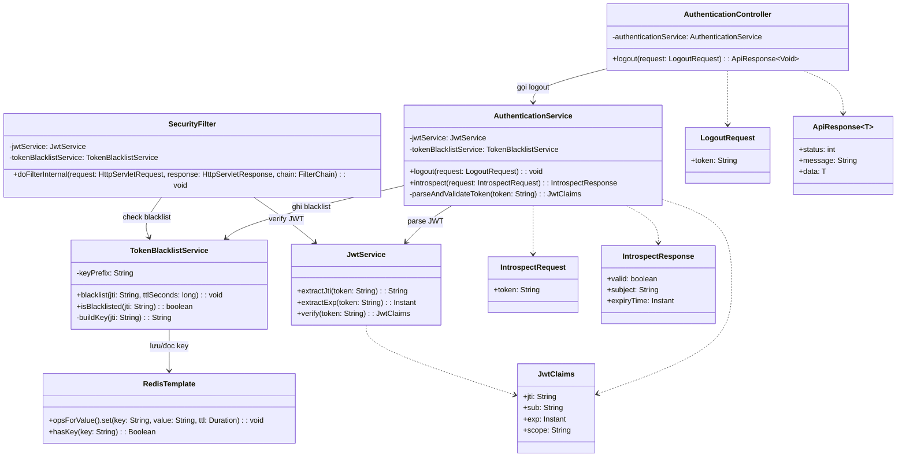

# Blacklist JWT khi logout - Sơ đồ lớp (Mermaid)

## Ghi chú
- `TokenBlacklistService` là lớp trung tâm khi tích hợp Redis.
- `SecurityFilter` (hoặc lớp verify token tương đương) cần kiểm tra blacklist ở mọi request bảo vệ.
- Có thể dùng `StringRedisTemplate` thay cho `RedisTemplate` nếu chỉ lưu chuỗi.
