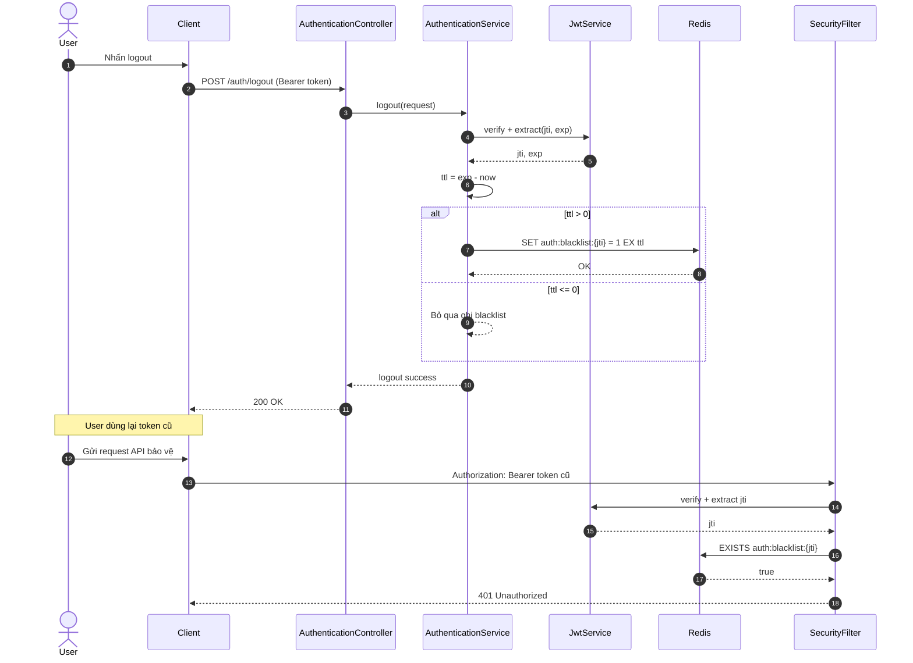

# Blacklist JWT khi logout - Sequence Diagram (Mermaid)

## Điểm kiểm soát bảo mật
- Check blacklist phải nằm trong luồng xác thực cho mọi endpoint bảo vệ.
- TTL phải bám sát `exp` để tránh key sống lâu không cần thiết.
- Ưu tiên token có `jti` duy nhất cho từng lần phát hành.
