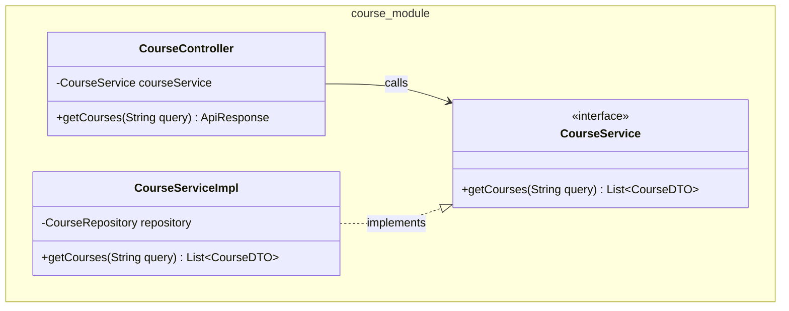

# Skill: Generate Class Diagram Documentation

## Goal
Tự động quét mã nguồn của một tính năng (feature) hoặc phân hệ (module) cụ thể và sinh ra tài liệu kỹ thuật dạng Markdown chứa sơ đồ lớp (Class Diagram) sử dụng cú pháp **Mermaid**.

## Trigger
Người dùng yêu cầu: "Tạo sơ đồ lớp cho tính năng X", "Sinh tài liệu class diagram cho module Y", hoặc "Vẽ UML cho luồng Z".

## Execution Steps

### 1. Phân tích yêu cầu và Khảo sát
- Xác định module/tính năng người dùng muốn mô tả (ví dụ: `Register`, `Course`, `Payment`).
- Sử dụng các công cụ tìm kiếm (`list_dir`, `grep_search`) để tìm tất cả các file Java liên quan đến tính năng đó. Thường bao gồm:
  - **Controller** (giao tiếp HTTP)
  - **Service** / **ServiceImpl** (logic nghiệp vụ)
  - **Repository** (truy xuất dữ liệu)
  - **Entity** (mô hình dữ liệu)
  - **DTO / Request / Response** (dữ liệu truyền tải)
  - **Mapper** (chuyển đổi dữ liệu)
  - **Event / Listener** (nếu có dùng Kafka/Event-driven)

### 2. Trích xuất thông tin
- Đọc nội dung các class chính.
- Ghi nhận lại các thuộc tính (attributes) quan trọng và các phương thức (methods) mang tính chất nghiệp vụ (không cần liệt kê các hàm getter/setter hay các hàm mặc định quá chi tiết).
- Xác định mối quan hệ giữa các class:
  - *Dependency / Gọi hàm*: `Controller` -> `Service`
  - *Implementation*: `ServiceImpl` implements `Service`
  - *Association*: `Service` chứa `Repository`
  - *Creation/Usage*: `Service` trả về `DTO`

### 3. Sinh mã Mermaid
- Tạo cấu trúc Markdown chuẩn và chèn khối lệnh `` ```mermaid `` với loại biểu đồ là `classDiagram`.
- Khai báo các class và phương thức/thuộc tính tương ứng.
- Vẽ các đường liên kết (ví dụ: `-->` cho Association, `..|>` cho Realization/Implements, `..>` cho Dependency).
- *Lưu ý*: Có thể sử dụng `namespace` trong Mermaid để nhóm các class theo package hoặc theo service (nếu là kiến trúc microservices).

**Ví dụ Format Mermaid:**


### 4. Lưu tài liệu
- Lưu file Markdown được sinh ra vào thư mục tài liệu của dự án.
- Vị trí chuẩn: `docs/features/[tên-module]/class_diagram.md` (nếu chưa có thư mục thì tự tạo).
- Chèn thêm một đoạn "Giải thích các thành phần" ở bên dưới sơ đồ để người đọc dễ hiểu hơn.

### 5. Thông báo hoàn tất
- Báo cáo cho người dùng đường dẫn file vừa tạo và tóm tắt nhanh các class đã được đưa vào sơ đồ.
