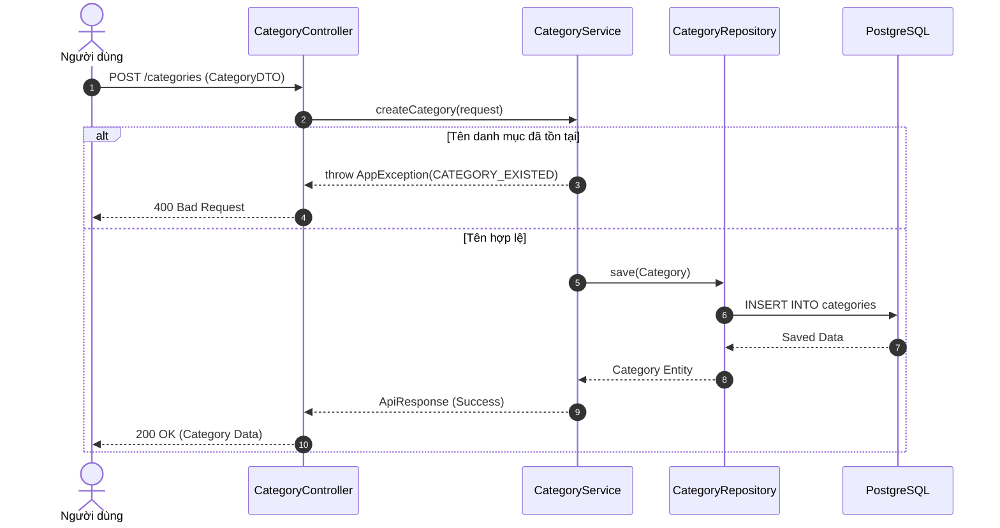

# Skill: Generate Sequence Diagram Documentation

## Goal
Tự động dò theo luồng thực thi mã nguồn (từ Controller xuống Database hoặc các hệ thống bên ngoài) của một tính năng cụ thể và sinh ra tài liệu **Sơ đồ tuần tự (Sequence Diagram)** sử dụng cú pháp **Mermaid**.

## Trigger
Người dùng yêu cầu: "Tạo sơ đồ tuần tự cho API X", "Vẽ sequence diagram cho luồng đăng ký", hoặc "Mô tả luồng xử lý của module Y".

## Execution Steps

### 1. Xác định Entry Point
- Yêu cầu người dùng chỉ định rõ tên API, tên hàm Controller hoặc tên tính năng cụ thể (ví dụ: `createCategory()`, "Luồng thanh toán khóa học").
- Mở file Controller tương ứng để làm điểm bắt đầu (Entry Point).

### 2. Dò theo luồng thực thi (Tracing Flow)
- Đọc code từ Controller, xem nó gọi đến phương thức nào của lớp Service.
- Mở file Service / ServiceImpl tương ứng, đọc logic nghiệp vụ bên trong:
  - Hàm có kiểm tra điều kiện (if/else) không? (Sẽ dùng khối `alt` hoặc `opt` trong Mermaid).
  - Hàm có gọi đến Repository (Database) không? 
  - Có phát sinh ngoại lệ (Exception) nào không?
  - Có gọi sang các hệ thống bên ngoài (Kafka, Gửi Mail, API bên thứ 3 như ZaloPay) không?
- Mở file Repository (nếu cần thiết) để xác định việc thao tác với Database.

### 3. Sinh mã Mermaid
- Sử dụng cú pháp `sequenceDiagram` của Mermaid.
- Định nghĩa các Actor và Participant theo thứ tự hợp lý (Thường là: Client -> Controller -> Service -> Repository -> Database / External System).
- Sử dụng các mũi tên tương ứng:
  - `->>` : Gọi hàm đồng bộ (Synchronous call).
  - `-->>` : Trả về kết quả (Return).
  - `-x` : Gọi hàm bất đồng bộ / Bắn Event (Asynchronous / Kafka Event).
- Gắn thêm số thứ tự bước bằng từ khóa `autonumber`.
- (Tùy chọn) Sử dụng `rect` để làm nổi bật các khối xử lý quan trọng.

**Ví dụ Format Mermaid:**

### 4. Lưu tài liệu
- Lưu file Markdown được sinh ra vào thư mục tài liệu của dự án.
- Vị trí chuẩn: `docs/features/[tên-module]/[tên-luồng]_sequence_diagram.md` (ví dụ: `docs/features/category/create_category_sequence.md`).
- Có thể kết hợp vào file chung của module nếu được yêu cầu.

### 5. Review & Thông báo hoàn tất
- Đảm bảo luồng vẽ trong Mermaid khớp 100% với code thực tế.
- Trả về đường dẫn file và tóm tắt ngắn gọn các bước chính của luồng cho người dùng.
