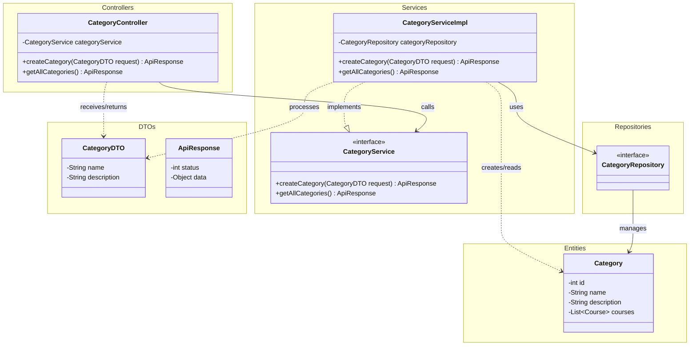

# Sơ đồ lớp (Class Diagram) - Category Module

Tài liệu này mô tả kiến trúc và mối quan hệ giữa các thành phần mã nguồn trong phân hệ **Category** (Quản lý danh mục khóa học).

## Sơ đồ Mermaid

## Giải thích các thành phần

- **`CategoryController`**: Lớp điều khiển giao tiếp với Client qua HTTP (REST API). Chứa các endpoint như `POST /categories` và `GET /categories`. Gọi đến `CategoryService` để xử lý logic.
- **`CategoryService` (Interface) & `CategoryServiceImpl`**: Tầng chứa logic nghiệp vụ cốt lõi của việc thêm mới và lấy danh sách danh mục. Tách biệt interface và implementation giúp dễ dàng viết Unit Test hoặc thay đổi logic sau này.
- **`CategoryRepository`**: Interface giao tiếp với CSDL (kế thừa từ Spring Data JPA), chịu trách nhiệm CRUD dữ liệu của bảng `categories`.
- **`Category` (Entity)**: Mô hình dữ liệu đại diện cho một bản ghi trong Database. Nó có mối quan hệ One-to-Many với `Course`.
- **`CategoryDTO`**: Đối tượng truyền tải dữ liệu giữa Client và Server, giúp ẩn đi cấu trúc thực sự của Entity.
