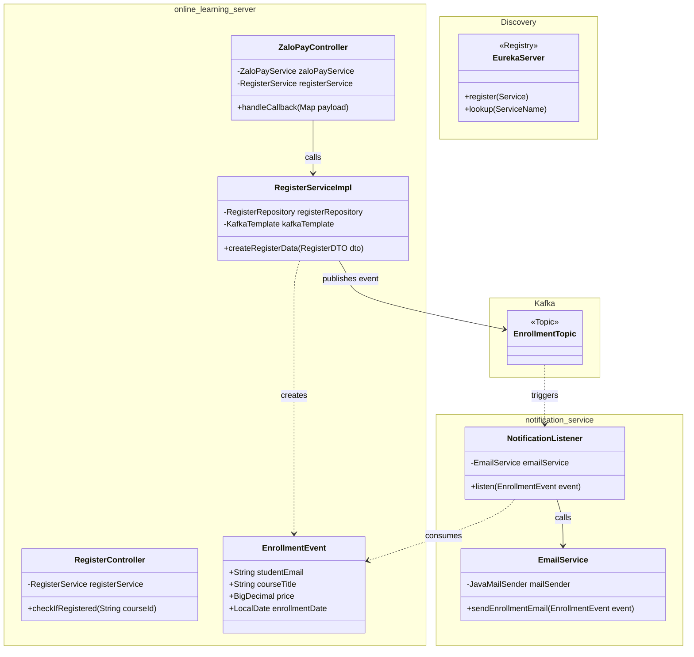

# Sơ đồ lớp (Class Diagram) - Kafka Enrollment Notification

Sơ đồ dưới đây mô tả mối quan hệ giữa các lớp trong cả hai dịch vụ `online_learning_server` và `notification-service`.

## Giải thích các thành phần:
- **RegisterServiceImpl**: Đóng vai trò là **Producer**. Sau khi thực hiện nghiệp vụ lưu vào DB, nó sử dụng `KafkaTemplate` để bắn sự kiện đi.
- **EnrollmentEvent**: Là đối tượng chứa dữ liệu (Data Transfer Object) được dùng chung (hoặc định nghĩa tương đương) ở cả hai bên.
- **NotificationListener**: Đóng vai trò là **Consumer**. Nó lắng nghe topic và chuyển tiếp dữ liệu đến dịch vụ gửi email.
- **EmailService**: Chịu trách nhiệm về logic định dạng email và giao tiếp với SMTP Server.
