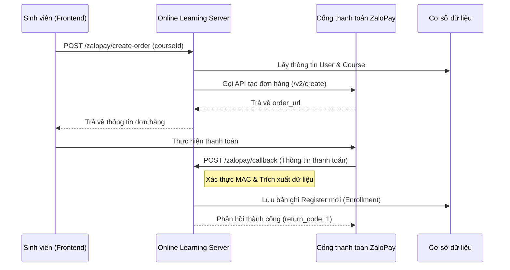

# Luồng hoạt động: Đăng ký khóa học (Enrollment Flow)

Tài liệu này mô tả chi tiết quy trình đăng ký khóa học trong hệ thống Online Learning, bao gồm cả luồng đăng ký trực tiếp và luồng thanh toán qua ZaloPay.

## 1. Tổng quan
Tính năng đăng ký khóa học cho phép sinh viên ghi danh vào một khóa học cụ thể. Sau khi đăng ký thành công, sinh viên có quyền truy cập vào các bài học và nội dung của khóa học đó.

## 2. Các thành phần chính (Core Components)

### Backend Classes:
- **`RegisterController`**: Xử lý các yêu cầu đăng ký trực tiếp và kiểm tra trạng thái.
- **`ZaloPayController`**: Xử lý việc tạo đơn hàng và nhận phản hồi (callback) từ cổng thanh toán ZaloPay.
- **`RegisterService` / `RegisterServiceImpl`**: Chứa logic nghiệp vụ lưu trữ thông tin đăng ký vào cơ sở dữ liệu.
- **`ZaloPayService` / `ZaloPayServiceImpl`**: Xử lý giao tiếp với API của ZaloPay.

### Database Entities:
- **`Register`**: Lưu trữ mối quan hệ giữa `User` (sinh viên) và `Course` (khóa học).
- **`User`**: Thông tin người dùng.
- **`Course`**: Thông tin khóa học (bao gồm giá `newPrice`).

---

## 3. Quy trình thực hiện (Process Flow)

### Luồng A: Khởi tạo đơn hàng (Dành cho khóa học có phí)

1. **Yêu cầu từ Client**: Người dùng nhấn nút "Mua khóa học" hoặc "Đăng ký".
2. **API Endpoint**: `POST /zalopay/create-order?courseId={id}`
3. **Xử lý tại Server**:
    - Lấy thông tin người dùng hiện tại từ Security Context.
    - Truy vấn thông tin khóa học từ `CourseRepository` để lấy giá và tiêu đề.
    - Đóng gói dữ liệu đơn hàng bao gồm:
        - `app_user`: Email của người dùng.
        - `amount`: Giá khóa học.
        - `embed_data`: Chứa `courseId` để xử lý sau khi thanh toán thành công.
        - `item`: Thông tin chi tiết khóa học.
    - Gọi API ZaloPay (`/v2/create`) để tạo đơn hàng.
4. **Phản hồi**: Trả về `order_url` (để redirect người dùng sang trang thanh toán) và `zp_trans_token`.

### Luồng B: Xử lý Callback (Hoàn tất đăng ký sau khi thanh toán)

1. **Sự kiện**: Sau khi người dùng thanh toán thành công trên ZaloPay, ZaloPay gửi một POST request đến Server.
2. **API Endpoint**: `POST /zalopay/callback`
3. **Xử lý tại Server**:
    - **Xác thực**: Kiểm tra chữ ký (MAC) của payload nhận được bằng `KEY_2` để đảm bảo yêu cầu đến từ ZaloPay.
    - **Trích xuất dữ liệu**:
        - Lấy `courseId` từ trường `embed_data`.
        - Lấy email người dùng từ trường `app_user`.
        - Lấy số tiền thanh toán từ trường `amount`.
    - **Lưu dữ liệu**: Gọi `registerService.createRegisterData()` để:
        - Tìm User theo email.
        - Tìm Course theo ID.
        - Tạo và lưu entity `Register` mới với ngày đăng ký hiện tại.
4. **Phản hồi**: Trả về `return_code: 1` cho ZaloPay để xác nhận đã xử lý thành công.

### Luồng C: Kiểm tra trạng thái đăng ký

1. **Mục đích**: Dùng để hiển thị trạng thái "Đã đăng ký" hoặc "Tiếp tục học" trên giao diện.
2. **API Endpoint**: `GET /registers/check?courseId={id}`
3. **Xử lý**: `RegisterService` kiểm tra trong danh sách `registers` của người dùng hiện tại xem đã có bản ghi nào tương ứng với `courseId` chưa.

---

## 4. Sơ đồ tuần tự (Sequence Diagram - Tham khảo)

## 5. Lưu ý quan trọng
- **Tính bảo mật**: Chữ ký MAC được sử dụng ở cả bước tạo đơn hàng (KEY1) và bước nhận callback (KEY2) để chống giả mạo.
- **Trạng thái**: Hiện tại logic đăng ký được kích hoạt chủ yếu qua luồng thanh toán. Các khóa học miễn phí có thể được mở rộng bằng cách gọi trực tiếp `createRegisterData`.
- **Dữ liệu**: Bảng `registers` đóng vai trò là bảng lịch sử sở hữu khóa học của người dùng.
