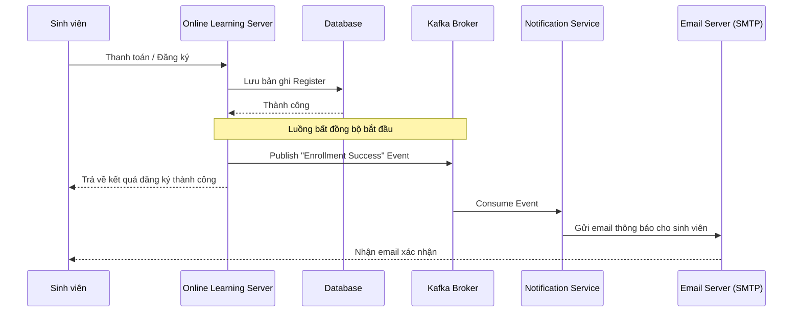

# Luồng hoạt động mới: Đăng ký khóa học & Thông báo (Kafka Integration)

Tài liệu này mô tả luồng hoạt động cải tiến của tính năng đăng ký khóa học, tích hợp thêm hệ thống **Kafka** để xử lý thông báo gửi email một cách bất đồng bộ (asynchronous) thông qua **Notification Service**.

## 1. Kiến trúc tổng quan
Hệ thống chuyển dịch sang mô hình Microservices/Event-driven:
- **Online Learning Server (Producer)**: Xử lý nghiệp vụ đăng ký và phát đi sự kiện. Đóng vai trò là Eureka Client.
- **Notification Service (Consumer)**: Lắng nghe sự kiện và thực hiện gửi email thông báo. Đóng vai trò là Eureka Client.
- **Eureka Server**: Trung tâm đăng ký và phát hiện dịch vụ (Service Discovery).
- **Kafka Broker**: Hệ thống trung gian điều phối tin nhắn.

---

## 2. Các thành phần bổ sung

### Hạ tầng (Docker):
- **Zookeeper**: Quản lý trạng thái các node trong Kafka cluster (hoặc dùng KRaft mode).
- **Kafka Broker**: Chạy tại cổng `9092` (nội bộ) và `9094` (bên ngoài).

### Dịch vụ Đăng ký (Eureka Server):
- Nằm trong thư mục `eureka-server`.
- Cung cấp giao diện quản lý các dịch vụ đang chạy tại `http://localhost:8761`.

### Dịch vụ thông báo (Notification Service):
- Nằm trong thư mục `services/notification`.
- Đăng ký tên dịch vụ `notification-service` với Eureka.
- Sử dụng `spring-kafka` để lắng nghe (consume) tin nhắn.
- Sử dụng `spring-boot-starter-mail` để gửi email thực tế cho người dùng.

### Online Learning Server:
- Đăng ký tên dịch vụ `online-learning-server` với Eureka.

---

## 3. Luồng xử lý chi tiết (Enhanced Flow)

### Bước 1: Lưu dữ liệu đăng ký (Tương tự luồng cũ)
Khi nhận được callback từ ZaloPay hoặc đăng ký khóa học miễn phí, `online_learning_server` sẽ:
- Lưu bản ghi vào bảng `registers` trong Database.

### Bước 2: Phát sự kiện (Publish Event)
Sau khi lưu DB thành công, `RegisterService` sẽ gửi một đối tượng `EnrollmentEvent` vào Kafka topic: `enrollment-topic`.
- **Dữ liệu Message**:
    ```json
    {
      "studentEmail": "student@example.com",
      "courseTitle": "Lập trình Java Spring Boot",
      "enrollmentDate": "2024-04-23",
      "price": 500000
    }
    ```

### Bước 3: Tiêu thụ sự kiện (Consume Event)
`Notification Service` liên tục lắng nghe topic `enrollment-topic`. Ngay khi có tin nhắn mới:
- Kiểm tra tính hợp lệ của dữ liệu.
- Chuẩn bị template email thông báo đăng ký thành công.

### Bước 4: Gửi Email
`Notification Service` thực hiện gửi email đến địa chỉ `studentEmail`. Quá trình này diễn ra bất đồng bộ, không làm chậm phản hồi của API thanh toán.

---

## 4. Sơ đồ tuần tự mở rộng (Sequence Diagram)



---

## 5. Cấu hình Docker Compose (Tham khảo)

Để chạy Kafka cho luồng này, file `docker-compose.yaml` cần bổ sung các dịch vụ sau:

```yaml
  eureka:
    build:
      context: ../eureka-server
    ports:
      - "8761:8761"

  zookeeper:
    image: confluentinc/cp-zookeeper:latest
    environment:
      ZOOKEEPER_CLIENT_PORT: 2181
      ZOOKEEPER_TICK_TIME: 2000

  kafka:
    image: confluentinc/cp-kafka:latest
    depends_on:
      - zookeeper
    ports:
      - "9092:9092"
    environment:
      KAFKA_BROKER_ID: 1
      KAFKA_ZOOKEEPER_CONNECT: zookeeper:2181
      KAFKA_ADVERTISED_LISTENERS: PLAINTEXT://kafka:29092,PLAINTEXT_HOST://localhost:9092
      KAFKA_LISTENER_SECURITY_PROTOCOL_MAP: PLAINTEXT:PLAINTEXT,PLAINTEXT_HOST:PLAINTEXT
      KAFKA_INTER_BROKER_LISTENER_NAME: PLAINTEXT
      KAFKA_OFFSETS_TOPIC_REPLICATION_FACTOR: 1
```

## 6. Lợi ích của luồng mới
- **Tách biệt mối quan tâm (Separation of Concerns)**: Server chính không cần biết về logic gửi email.
- **Khả năng mở rộng (Scalability)**: Có thể chạy nhiều instance của Notification Service để xử lý lượng lớn email.
- **Độ tin cậy (Resilience)**: Nếu Notification Service tạm thời gặp sự cố, tin nhắn vẫn nằm trong Kafka và sẽ được xử lý lại khi service hoạt động trở lại.
