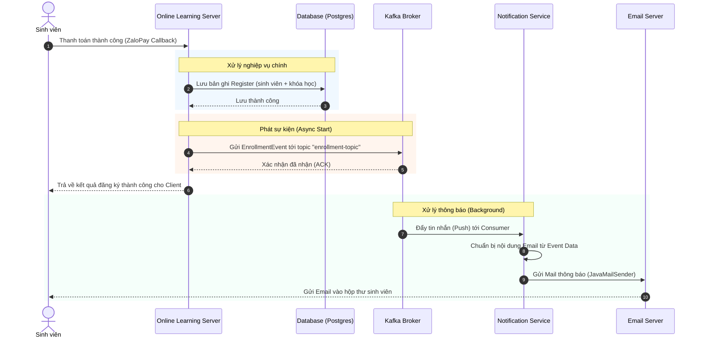

# Sơ đồ tuần tự (Sequence Diagram) - Kafka Enrollment Notification

Sơ đồ này mô tả chi tiết các bước tương tác giữa người dùng, các microservices, hệ thống Kafka và máy chủ Email.

## Các giai đoạn chính:
1.  **Giai đoạn Đồng bộ (Synchronous)**: (Bước 1-3) Xử lý lưu trữ dữ liệu vào cơ sở dữ liệu chính. Đây là bước quan trọng nhất để đảm bảo tính toàn vẹn dữ liệu.
2.  **Giai đoạn Phát sự kiện**: (Bước 4-5) Server chính đẩy thông tin sang Kafka. Việc này diễn ra rất nhanh và không phụ thuộc vào việc email có được gửi thành công ngay lập tức hay không.
3.  **Giai đoạn Phản hồi**: (Bước 6) Người dùng nhận được thông báo thành công trên giao diện ngay lập tức mà không phải chờ quá trình gửi mail.
4.  **Giai đoạn Bất đồng bộ (Asynchronous)**: (Bước 7-10) Diễn ra hoàn toàn tách biệt ở phía sau. Nếu hệ thống email chậm hoặc gặp sự cố, Kafka sẽ lưu trữ tin nhắn để xử lý lại sau.
