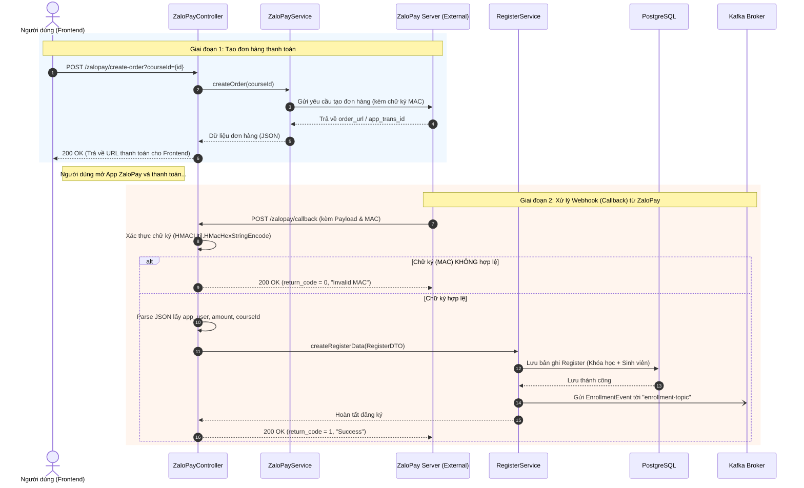

# Sơ đồ tuần tự (Sequence Diagram) - Luồng Thanh toán ZaloPay

Tài liệu này mô tả chi tiết luồng thực thi khi người dùng thực hiện thanh toán khóa học qua cổng ZaloPay, từ lúc khởi tạo đơn hàng cho đến khi hệ thống nhận được callback xác nhận và cấp quyền truy cập khóa học.

## Sơ đồ Mermaid

## Giải thích các giai đoạn

### Giai đoạn 1: Tạo đơn hàng
1. Người dùng bấm nút "Thanh toán" trên giao diện, Frontend gọi API `create-order` kèm ID khóa học.
2. `ZaloPayService` tính toán số tiền, tạo mã giao dịch (`app_trans_id`) và mã hóa chữ ký (MAC) rồi gửi sang server thật của ZaloPay.
3. ZaloPay trả về một URL (hoặc mã QR), hệ thống Vitube chuyển tiếp URL này về cho Frontend để người dùng mở ứng dụng ZaloPay thanh toán.

### Giai đoạn 2: Xử lý Callback (Webhook)
4. Sau khi người dùng chuyển tiền thành công, Server ZaloPay sẽ tự động gọi ngược lại API `/zalopay/callback` của Vitube để báo tin.
5. `ZaloPayController` bắt buộc phải kiểm tra tính toàn vẹn của dữ liệu bằng hàm băm `HMAC SHA256`. Nếu mã băm không khớp, yêu cầu bị từ chối (tránh giả mạo).
6. Nếu hợp lệ, hệ thống trích xuất thông tin người dùng và khóa học, sau đó gọi `RegisterService` để lưu thông tin đăng ký vào Database.
7. Cuối cùng, `RegisterService` bắn một sự kiện bất đồng bộ sang **Kafka** để báo cho `Notification Service` gửi email cảm ơn, đồng thời phản hồi `return_code = 1` cho ZaloPay để đóng giao dịch.
